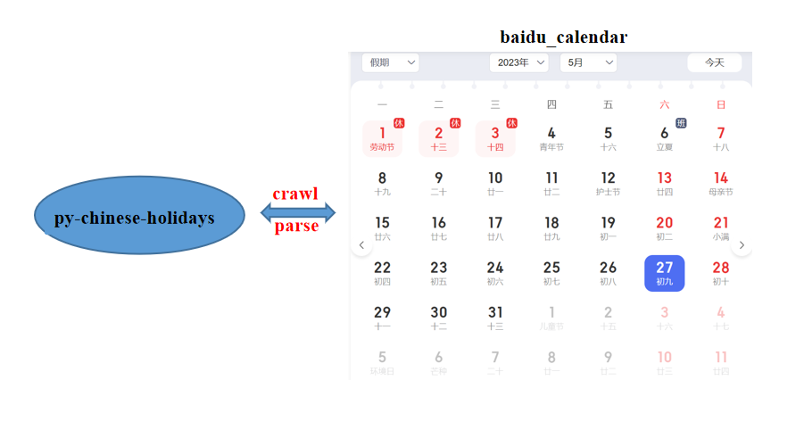

# py-chinese-holidays
<p align="center">
  
</p>
Description: Calculate Chinese holidays, traditional festivals, and rest days for a specified year. <br>
Code: https://github.com/ymzx/chinese-holidays <br>
PyPi: https://pypi.org/project/py-chinese-holidays/  <br>
Method: We utilize web scraping from Baidu Online Calendar to retrieve real-time and accurate information by parsing the crawled data. <br>
Flowchart: <br>



### Installation
> pip install py-chinese-holidays

### 本项目主要内容：
输入指定的年份字符，例如'2023'
- 🚀 输出指定年份所有法定休息日
- 🚀 输出指定年份所有法定节假日，例如元旦、春节、劳动节、国庆节等
- 🚀 输出指定年份所有传统节假日，例如重阳节、龙头节、端午节等
- 🚀 输出指定年份所有节日（包括法定节假日、传统节日等），例如女生节、植树节、防治结核病日、世界读书日、母亲节等
- 🚀 计算指定年份每天日期属性，包括农历阴历、属相、忌宜事项、是否休息、是否节日等信息


#### 接口使用示例

```python
from chinese_holidays import get_holidays
data = get_holidays(year='2023', result_save_dir=r'D:\project\enn_lp_xndc\load_baseline\src')

```
'year' —— 指定计算年份   
'result_save_dir' —— 计算结果以json格式保存路径，程序在指定路径下生成{year}_holidays_info.json，可选参数，如果不指定直接返回结果到data
#### 💡 接口调用效果展示
⭐ 全年每天属性信息，以'2023-01-01'为例
```python
{
    'animal': '虎',
    'avoid': '栽种.安门.治病.作灶',
    'suit': '动土.祈福.安床.架马.开厕.祭祀.入殓.成人礼.成服.除服.伐木.结网.开池.求子',
    'weekday': '日',
    'year': '2023',
    'month': '1',
    'day': '1',
    'date': '2023-01-01',
    'gzDate': '己未',
    'gzMonth': '壬子',
    'gzYear': '壬寅',
    'lunarDay': '10',
    'lunarMonth': '12',
    'lunarYear': '2022',
    'lunarDate': '2022-12-10',
    'lDay': '初十',
    'lMonth': '腊',
    'status': '1',
    'generalFestival': '元旦',
    'traditionalFestival': None,
    'nationalHoliday': '元旦',
    'isRestDay': True
}
```
> 注意：元旦确实不属于中国传统节日 <br>
> status为1的时候表示休息日，百度日历上会有休标志的数据,可作为非周末的法定节假日的休息日

⭐ 2023年国家法定节假日
```python
[
    {'value': '元旦', 'date': '2023-01-01'}, 
    {'value': '除夕', 'date': '2023-01-21'}, 
    {'value': '春节', 'date': '2023-01-22'}, 
    {'value': '劳动节', 'date': '2023-05-01'}, 
    {'value': '端午节', 'date': '2023-06-22'}, 
    {'value': '中秋节', 'date': '2023-09-29'}, 
    {'value': '国庆节','date': '2023-10-01'}
]
```

⭐ 2023年国家传统节日
```python
[
    {'value': '北小年', 'date': '2023-01-14'}, 
    {'value': '除夕', 'date': '2023-01-21'}, 
    {'value': '春节', 'date': '2023-01-22'}, 
    {'value': '元宵节', 'date': '2023-02-05'}, 
    {'value': '龙头节', 'date': '2023-02-21'}, 
    {'value': '龙头节 世界气象日', 'date': '2023-03-23'}, 
    {'value': '端午节', 'date': '2023-06-22'}, 
    {'value': '七夕节', 'date': '2023-08-22'}, 
    {'value': '中秋节', 'date': '2023-09-29'}, 
    {'value': '重阳节', 'date': '2023-10-23'}, 
    {'value': '寒衣节', 'date': '2023-11-13'}
]
```
> 注意：闰二月 <br>

⭐ 2023年一般节日部分示例 <br>
```python
[
    {'value': '大寒', 'date': '2023-01-20'}, 
    {'value': '除夕', 'date': '2023-01-21'}, 
    {'value': '春节', 'date': '2023-01-22'}, 
    {'value': '国际海关日', 'date': '2023-01-26'}, 
    {'value': '五九', 'date': '2023-01-27'}, 
    {'value': '湿地日', 'date': '2023-02-02'}, 
    {'value': '立春', 'date': '2023-02-04'}, 
    {'value': '元宵节,六九', 'date': '2023-02-05'}, 
    {'value': '国际气象节', 'date': '2023-02-10'}, 
    {'value': '情人节,七九', 'date': '2023-02-14'},
    ...
] 
```

⭐ 2023年休息日部分示例 <br>
- 如果存在调休，周末不一定休息
- 如果存在法定节假日，工作日可能休息
- 不考虑半天假期或者男放女不放假，例如妇女节半天假期视为工作日
```python
[
    {'value': True, 'date': '2023-12-09'}, 
    {'value': True, 'date': '2023-12-10'}, 
    {'value': True, 'date': '2023-12-16'}, 
    {'value': True, 'date': '2023-12-17'}, 
    {'value': True, 'date': '2023-12-23'}, 
    {'value': True, 'date': '2023-12-24'},
    ...
]
```
> 注意：value为True表示休息日 <br>